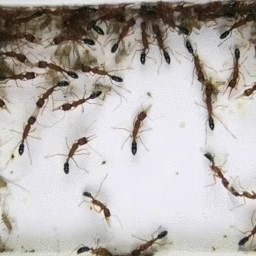
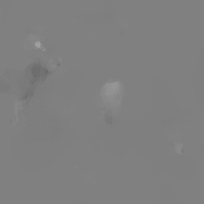
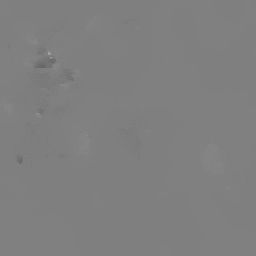
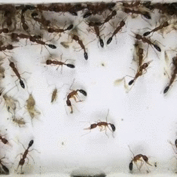
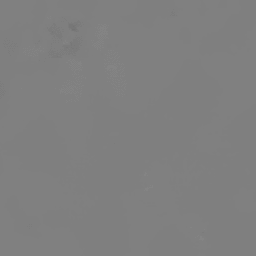
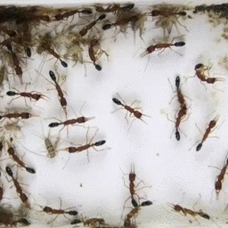
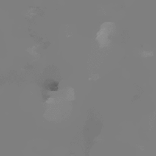

<!-- # OpticalFlows_HsAnts -->

# Introduction
Optical flow dataset used in 
*"Identification of Abnormal States in Videos of Ants Undergoing Social Phase Change"*,
*Taeyeong Choi, Benjamin Pyenson, Juergen Liebig, Theodore P. Pavlic*, 
Submitted to [IAAI-21](https://aaai.org/Conferences/AAAI-21/iaai-21-call/). 

Optical flows were extracted every >2 minutes from 20-day video recording of a colony of >50 Harpegnathos saltator ants.
First 2-day data were labelled as "stable" class while the rest were as "unstable" to build an One-class classifier that can 
detect abnormal behaviors although it is trained only with normal ones.  

# Brief Backgrounds on *H. saltator*

- All female workers in *H. saltator* are physically capable of laying eggs.  
- Multiple egg layers can coexist in a nest sharing a high social class together. 
- The subset of reproducers, also called *gamergates*, inhibit others from being engaged in reproductive activities via aggressive interactions.
- As some gamergates die or age decreasing their reproduction ability, a social competition begins for other workers to steal the role. 
- The competition accompanies *unstable* state of the colony with frequent hostile interactions among members, such as *dueling* and *dominance biting*. 
- After several days or weeks, the society cools down to stable state as new gamergates are elected.  

# Main Configurations for Recording

1. A colony of 54 *Harpegnathos saltator* was recorded for 20 days by an overhead camera in a lab setting where the plastic arena was covered by a glass on the top.
1. Not all ants are visible if some have gone to a chamber for food (crickets) led by a tunnel on the bottom. 
1. After Day 2, the whole colony was manipulated to be unstable by removing all recognized egg layers. 
1. A social tournament was observed to be initiated involving intensive, aggressive interactions among ants. 
1. Only little antagonistic behaviors were found on the last several days. 

You can see actual ant behaviors from the 3-minute highlight video of our recording below where days are denoted as "D-2", "D-1", "D+1", ..., "D+18" based on the removal event: 

# Data Description

- *m* sequential x,y optical flows are sampled every >2 minutes each from two consecutive frame images at the interval of 0.5 seconds. 
- For each optical flow image, redundant areas on the left and right side are removed, and it is resized to 64x64 spatial resolution. 
- 80% data of stable are used for training and the rest for test, while all unstable data are only for test. 

|           | Stable | Unstable |
|-----------|--------|----------|
| **Total** | 1,333  | 11,984   |
| **Train** | 1,067  | 0        |
| **Test**  | 266    | 11,984   |

- Three unique splits are prepared for extensive experiments. 

# Examples

(RGB - Flow_X - Flow_Y)

# References
