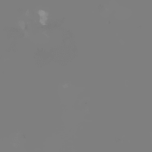
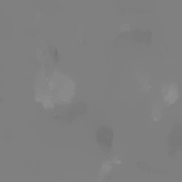

<!-- # OpticalFlows_HsAnts -->


# Introduction
Optical flow dataset used in paper <a href="https://ojs.aaai.org/index.php/AAAI/article/view/17794" target="_blank">*"Identification of Abnormal States in Videos of Ants Undergoing Social Phase Change", Taeyeong Choi, Benjamin Pyenson, Juergen Liebig, and Theodore P. Pavlic.*</a>
For citation, please see [this](https://github.com/ctyeong/OpticalFlows_HsAnts#citation). 

Optical flows were extracted every >2 minutes from 20-day video recording of a colony of >50 Harpegnathos saltator ants.
First 2-day data were labelled as "stable" class while the rest were as "unstable" to build an One-class classifier that can 
detect abnormal behaviors although it is trained only with normal ones.  

# Contents 

1. [Brief Backgrounds on *H. saltator*](https://github.com/ctyeong/OpticalFlows_HsAnts#brief-backgrounds-on-h-saltator)
2. [Main Configurations for Recording](https://github.com/ctyeong/OpticalFlows_HsAnts#main-configurations-for-recording)
3. [Short Highlight Video](https://github.com/ctyeong/OpticalFlows_HsAnts#short-highlight-video)
4. [Data Description](https://github.com/ctyeong/OpticalFlows_HsAnts#data-description)
5. [Usage](https://github.com/ctyeong/OpticalFlows_HsAnts#usage)
6. [Optical Flow Examples](https://github.com/ctyeong/OpticalFlows_HsAnts#optical-flow-examples)
7. [Benchmark Performance](https://github.com/ctyeong/OpticalFlows_HsAnts#benchmark-performance)
8. [Citation](https://github.com/ctyeong/OpticalFlows_HsAnts#citation)
9. [References](https://github.com/ctyeong/OpticalFlows_HsAnts#references)

# Brief Backgrounds on *H. saltator*

- All female workers in *H. saltator* are physically capable of laying eggs.  
- Multiple egg layers can coexist in a nest sharing a high social class together. 
- The subset of reproducers, also called *gamergates*, inhibit others from being engaged in reproductive activities via aggressive interactions.
- As some gamergates die or age decreasing their reproduction ability, a social competition begins for other workers to steal the role. 
- The competition accompanies *unstable* state of the colony with frequent hostile interactions among members, such as *dueling* and *dominance biting*. 
- After several days or weeks, the society cools down to stable state as new gamergates are elected.  

# Main Configurations for Recording

1. A colony of 59 *Harpegnathos saltator* was recorded for 20 days by an overhead camera in a lab setting where the plastic arena was covered by a glass on the top.
1. Not all ants are visible if some have gone to a chamber for food (crickets) led by a tunnel on the bottom. 
1. After Day 2, the whole colony was manipulated to be unstable by removing all recognized egg layers. 
1. A social tournament was observed to be initiated involving intensive, aggressive interactions among ants. 
1. Only little antagonistic behaviors were found on the last several days. 

# Short Highlight Video

You can see actual ant behaviors from the 3-minute highlight video of our recording below where days are denoted as "D-2", "D-1", "D+1", ..., "D+18" at the top-right corner based on the removal event. To watch, click the image below: 
[](http://www.youtube.com/watch?v=eGFQb45QejQ "")

# Data Description

- *m=4* sequential x,y optical flows are sampled every >2 minutes each from two consecutive frame images at the interval of 0.5 seconds. 
- For each optical flow image, redundant areas on the left and right side are removed, and it is resized to 64x64 spatial resolution. 
- 80% data of stable are used for training and the rest for test, while all unstable data are only for test. 

|           | Stable             | Unstable            |
|-----------|--------------------|---------------------|
| **Total** | *1,333 x 4 (100%)* | *11,984 x 4 (100%)* |
| **Train** | *1,067 x 4 (80%)*  | *0 (0%)*            |
| **Test**  | *266 x 4 (20%)*    | *11,984 x 4 (100%)* |

- All optical flows were extracted by the code at [Temporal Segment Networks (TSN) [1]](https://github.com/yjxiong/temporal-segment-networks).

# Usage

- Tap on "Code" at the top right corner and "Download ZIP". Extract the downloaded file under the directory you prefer. 
- All are located under either *Stable/* or *Unstable/* depending on whether sampling was conducted before or after the removal of gamergates.
- File names are unique numbers determined by the temporal order of recording, i.e.) lower means earlier. 
- For each *i*-th sample, *m=4* sequential RGB images and optical flows are available in order, respectively:
  - *{img_i-0.jpg, img_i-1.jpg, img_i-2.jpg, img_i-3.jpg}*
  - *{flow_x_i-0.jpg, flow_x_i-1.jpg, flow_x_i-2.jpg, flow_x_i-3.jpg}*
  - *{flow_y_i-0.jpg, flow_y_i-1.jpg, flow_y_i-2.jpg, flow_y_i-3.jpg}*
- *Split_k/* provides a unique split of *train.csv* and *test.csv*, each of which contains the involved file numbers of *Stable/* for the corresponding dataset. (*Split1*, *Split2*, and *Split3* here were used to report average performance of proposed model in our *IAAI-21* work)

# Optical Flow Examples

(RGB - Flow_X - Flow_Y)


<!-- 
 -->


<!-- 
 -->


<!-- 
 -->


<!-- 
 -->


<!--  -->
<!--  -->

# Benchmark Performance

Please follow [this link](https://github.com/ctyeong/IO-GEN#benchmark-performance) to the website of the Python codes for IO-GEN, which my colleagues and I have proposed in [this paper](https://github.com/ctyeong/OpticalFlows_HsAnts#citation) to effectively detect unstable class when only stable class is available to learn the parameters of the model.

# Citation

If you use this dataset for your research, please cite our paper:

```
@inproceedings{CPLP21,
  title={Identification of Abnormal States in Videos of Ants Undergoing Social Phase Change},
  author={Choi, Taeyeong and Pyenson, Benjamin and Liebig, Juergen and Pavlic, Theodore P},
  booktitle={Proceedings of the AAAI Conference on Artificial Intelligence},
  year={2021}
}
```

# Contact

If there is any questions about the dataset, please do not hesitate to shoot an email to tchoi@lincoln.ac.uk or bpyenson@asu.edu. Thanks!

# References

[1] Limin Wang, Yuanjun Xiong, Zhe Wang, Yu Qiao, Dahua Lin, Xiaoou Tang, and Luc Van Gool, Temporal Segment Networks: Towards Good Practices for Deep Action Recognition, *ECCV*, 2016.